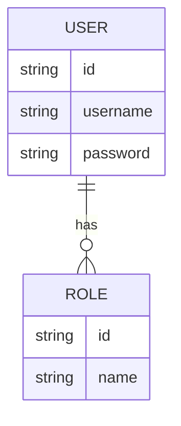
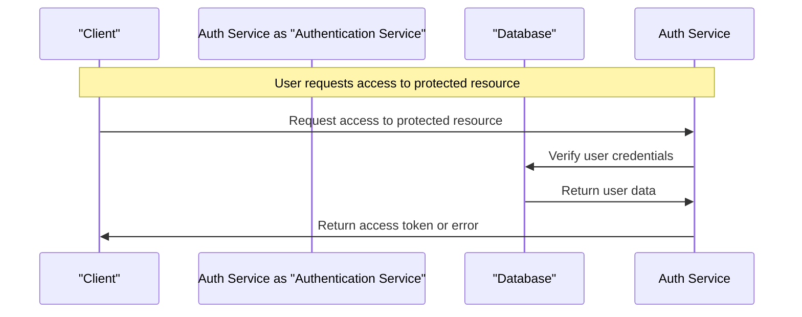

# Authentication Service Documentation
## Overview

The Authentication Service is a complex system designed to handle user authentication and authorization. It is part of a larger system consisting of multiple microservices, including language modeling, graph analytics, and UI components. Each service is designed to perform specific functions, and they interact with each other to provide a comprehensive solution.

## Features and Functionality

The Authentication Service provides the following features and functionality:

* User authentication and authorization
* Support for multiple authentication strategies (e.g., OAuth2, JWT)
* User management (e.g., creating, updating, deleting users)
* Role-based access control (RBAC)

## Implementation Details

The Authentication Service is implemented using Node.js and the Nest.js framework. It uses a relational database management system (RDBMS) to store user data.

### Database Schema

The database schema for the Authentication Service is as follows:

### Authentication Flow

The authentication flow for the Authentication Service is as follows:

### Setup Instructions

To set up the Authentication Service, follow these steps:

1. Install the required dependencies: `npm install` or `yarn install`
2. Configure the database connection: `cp config.example.json config.json` and update the database settings
3. Run the migrations: `npx nestjs migrations:run`
4. Start the service: `npx nestjs start`

## API Endpoints

The Authentication Service provides the following API endpoints:

* `POST /auth/login`: Login endpoint
* `POST /auth/register`: Register endpoint
* `GET /auth/user`: Get current user endpoint
* `PUT /auth/user`: Update user endpoint
* `DELETE /auth/user`: Delete user endpoint

## Security Considerations

The Authentication Service uses the following security measures to protect user data:

* Password hashing and salting
* Secure password reset
* Role-based access control (RBAC)
* HTTPS encryption