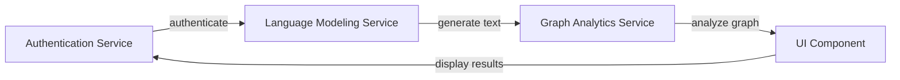
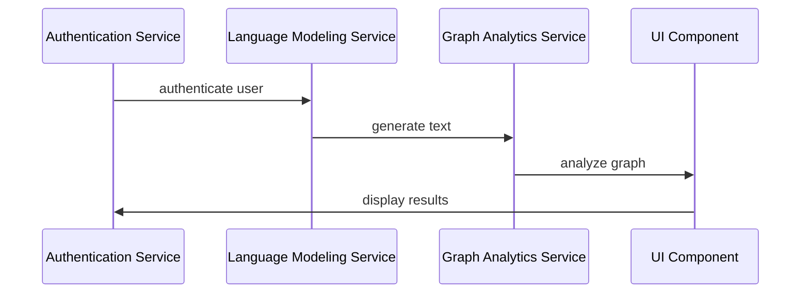
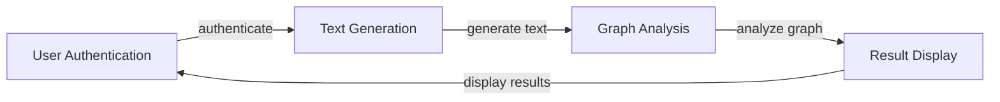

# Component Interaction Diagrams
The system consists of multiple microservices, including authentication, language modeling, graph analytics, and UI components. Each service is designed to perform specific functions, and they interact with each other to provide a comprehensive solution.

## System Architecture
The system architecture can be represented using the following mermaid diagram:

This diagram shows the interactions between the different microservices, including the authentication service, language modeling service, graph analytics service, and UI component.

## Service Interactions
The services interact with each other using RESTful APIs. The authentication service authenticates users and generates tokens, which are then used by the language modeling service to generate text. The graph analytics service analyzes the graph and returns the results to the UI component, which displays the results to the user.

## Data Flows
The data flows between the services can be represented using the following mermaid diagram:

This diagram shows the sequence of events and the data flows between the services.

## Core Workflows
The core workflows of the system can be represented using the following mermaid diagram:

This diagram shows the core workflows of the system, including user authentication, text generation, graph analysis, and result display.

## Setup Instructions
To set up the system, follow these steps:

1. Install the authentication service and configure it to authenticate users.
2. Install the language modeling service and configure it to generate text based on user input.
3. Install the graph analytics service and configure it to analyze the graph.
4. Install the UI component and configure it to display the results to the user.
5. Configure the services to interact with each other using RESTful APIs.

## Code Examples
The following code examples demonstrate how to implement the services and their interactions:
```typescript
// Authentication Service
import { Injectable } from '@nestjs/common';
import { AuthService } from './auth.service';

@Injectable()
export class AuthenticationController {
  constructor(private readonly authService: AuthService) {}

  async authenticateUser(username: string, password: string) {
    return this.authService.authenticateUser(username, password);
  }
}

// Language Modeling Service
import { Injectable } from '@nestjs/common';
import { LanguageModelService } from './language-model.service';

@Injectable()
export class LanguageModelController {
  constructor(private readonly languageModelService: LanguageModelService) {}

  async generateText(input: string) {
    return this.languageModelService.generateText(input);
  }
}

// Graph Analytics Service
import { Injectable } from '@nestjs/common';
import { GraphAnalyticsService } from './graph-analytics.service';

@Injectable()
export class GraphAnalyticsController {
  constructor(private readonly graphAnalyticsService: GraphAnalyticsService) {}

  async analyzeGraph(input: string) {
    return this.graphAnalyticsService.analyzeGraph(input);
  }
}

// UI Component
import { Component, OnInit } from '@angular/core';
import { UiService } from './ui.service';

@Component({
  selector: 'app-ui',
  template: '<div>Results: {{ results }}</div>',
})
export class UiComponent implements OnInit {
  results: string;

  constructor(private readonly uiService: UiService) {}

  ngOnInit() {
    this.uiService.displayResults().subscribe((results) => {
      this.results = results;
    });
  }
}
```
These code examples demonstrate how to implement the services and their interactions using TypeScript and Angular.