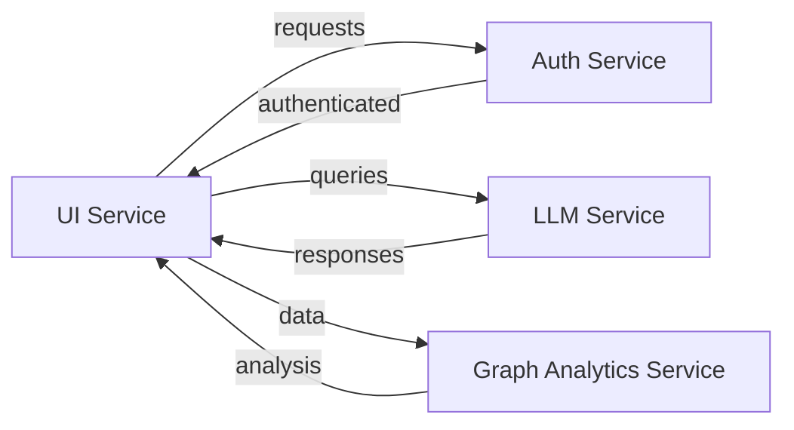
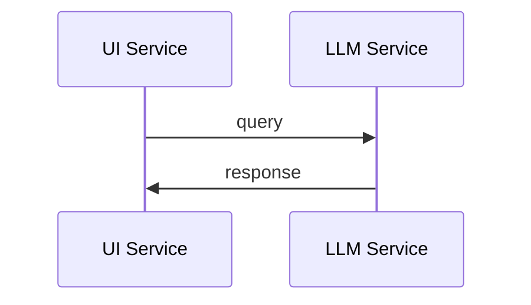

# Getting Started Guide
The project is a complex system consisting of multiple microservices, including authentication, language modeling, graph analytics, and UI components. This guide provides a step-by-step introduction to setting up the development environment, understanding the project structure, and running the application.

## Prerequisites
- Familiarity with JavaScript, TypeScript, and React

## Project Structure
The project is divided into several services, each with its own directory:
- `auth-service`: handles user authentication
- `llm-service`: provides language modeling capabilities
- `graph-analytics-service`: performs graph analytics
- `ui-service`: the user interface component

## Setup Instructions
1. Clone the repository: `git clone git@github.com:project/repository.git`
2. Install dependencies for each service:
   - `auth-service`: `npm install` or `pnpm install`
   - `llm-service`: `npm install` or `pnpm install`
   - `graph-analytics-service`: `npm install` or `pnpm install`
   - `ui-service`: `npm install` or `pnpm install`

## Running the Application
- Start each service individually:
  - `auth-service`: `npm run start` or `pnpm run start`
  - `llm-service`: `npm run start` or `pnpm run start`
  - `graph-analytics-service`: `npm run start` or `pnpm run start`
  - `ui-service`: `npm run start` or `pnpm run start`

## Component Relationships

This diagram illustrates the relationships between the different components, showing how they interact with each other to provide a comprehensive solution.

## Code Examples
For example, to authenticate a user, the `auth-service` provides an endpoint that can be called from the `ui-service`:
```typescript
// auth.service.ts
import { Injectable } from '@nestjs/common';

@Injectable()
export class AuthService {
  async authenticate(user: string, password: string) {
    // authentication logic here
    return true; // or false
  }
}
```

```typescript
// ui.service.ts
import { Injectable } from '@nestjs/common';
import { AuthService } from './auth.service';

@Injectable()
export class UIService {
  constructor(private authService: AuthService) {}

  async login(user: string, password: string) {
    const authenticated = await this.authService.authenticate(user, password);
    if (authenticated) {
      // login successful
    } else {
      // login failed
    }
  }
}
```
This example demonstrates how the `ui-service` interacts with the `auth-service` to authenticate a user.

## mermaid Art Diagrams
To visualize the component relationships and flows, mermaid art diagrams can be used. For instance, the sequence diagram below shows the interaction between the `ui-service` and `llm-service`:

This diagram illustrates the sequence of events between the two services, providing a clear understanding of how they interact.

By following this guide and understanding the relationships between the different components, developers can easily get started with the project and contribute to its development.