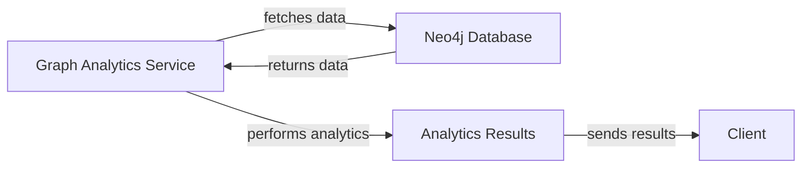

# Graph Analytics Service Overview
The Graph Analytics Service is a microservice designed to perform graph analytics operations. It is part of a larger system consisting of multiple microservices, including authentication, language modeling, and UI components.

## Features and Functionality
The Graph Analytics Service provides the following features and functionality:
* Graph data storage and management using Neo4j
* Graph analytics operations, such as node and edge analysis
* Integration with other microservices, such as authentication and language modeling
* Support for multiple data formats and protocols

## Implementation Details
The Graph Analytics Service is implemented using Node.js and TypeScript. It uses the Neo4j driver to interact with the graph database and performs analytics operations using custom algorithms and libraries.

### Code Example
```typescript
// src/thoughtGraph/ThoughtGraphService.ts
import { Inject, Injectable } from '@nestjs/common';
import { Neo4jService } from './neo4j/neo4j.service';

@Injectable()
export class ThoughtGraphService {
  constructor(
    @Inject('Neo4jService') private readonly neo4jService: Neo4jService,
  ) {}

  async getThoughtGraph(): Promise<any> {
    const query = `
      MATCH (n:Thought)
      RETURN n
    `;
    const result = await this.neo4jService.query(query);
    return result;
  }
}
```

## Setup Instructions
To set up the Graph Analytics Service, follow these steps:
1. Install the required dependencies, including Node.js, TypeScript, and Neo4j
2. Clone the `workdir/services/graph-analytics-service/` repository and navigate to the project directory
3. Run `npm install` to install the dependencies
4. Run `npm start` to start the service

## Mermaid Art Diagrams
