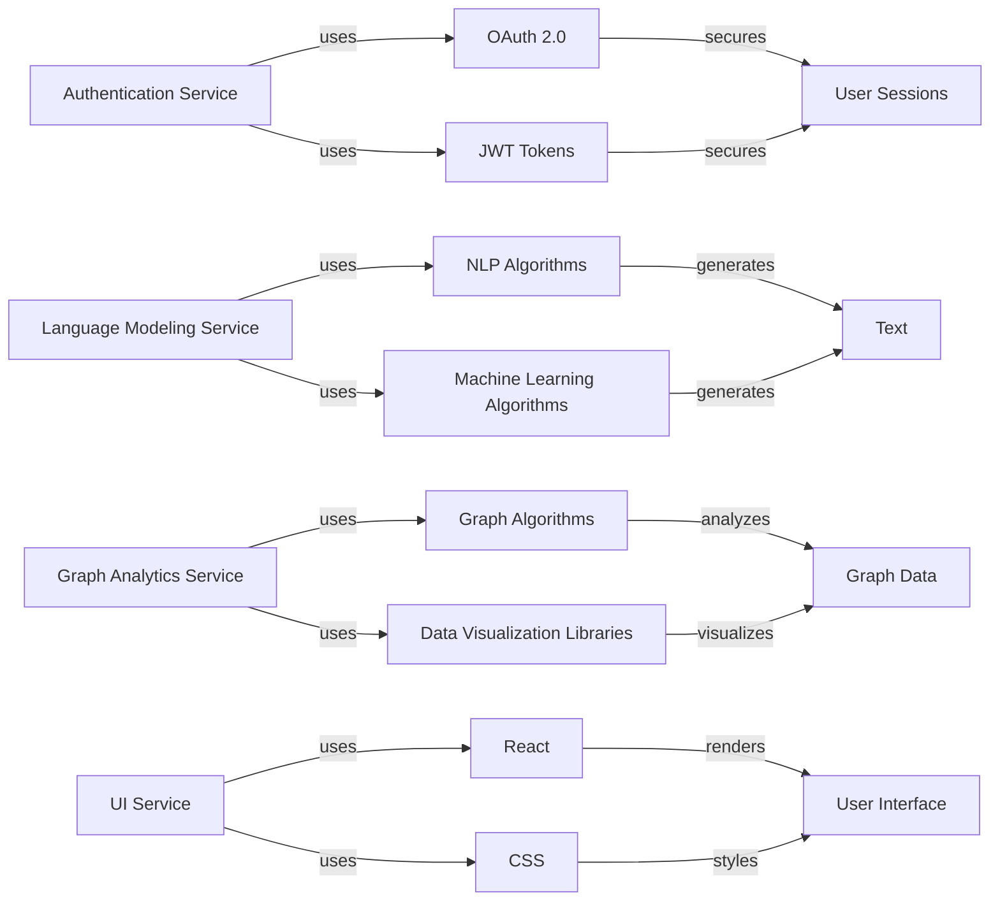

# Implementation Patterns and Use Cases
## Overview
This documentation provides a comprehensive guide to the implementation patterns and use cases for the microservices-based system. The system consists of multiple microservices, including authentication, language modeling, graph analytics, and UI components.

## Authentication Service
The authentication service is responsible for handling user authentication and authorization. It uses a combination of OAuth 2.0 and JWT tokens to secure user sessions.

### Implementation Details
The authentication service is built using Node.js and Express.js. It uses a PostgreSQL database to store user credentials and authentication tokens.

### Use Cases
* User registration and login
* Token-based authentication for protected routes
* Role-based access control

### Code Example
```typescript
// auth.service.ts
import { Injectable } from '@nestjs/common';
import { UsersService } from './users.service';

@Injectable()
export class AuthService {
  constructor(private readonly usersService: UsersService) {}

  async login(user: User): Promise<string> {
    const token = await this.usersService.generateToken(user);
    return token;
  }
}
```

## Language Modeling Service
The language modeling service is responsible for generating text based on a given prompt. It uses a combination of natural language processing (NLP) and machine learning algorithms to generate human-like text.

### Implementation Details
The language modeling service is built using Python and the Transformers library. It uses a pre-trained language model to generate text.

### Use Cases
* Text generation for chatbots and virtual assistants
* Content generation for social media and marketing campaigns

### Code Example
```python
# llm_service.py
import torch
from transformers import T5ForConditionalGeneration, T5Tokenizer

class LLMService:
  def __init__(self):
    self.model = T5ForConditionalGeneration.from_pretrained('t5-small')
    self.tokenizer = T5Tokenizer.from_pretrained('t5-small')

  def generate_text(self, prompt: str):
    input_ids = self.tokenizer.encode(prompt, return_tensors='pt')
    output = self.model.generate(input_ids)
    return self.tokenizer.decode(output[0], skip_special_tokens=True)
```

## Graph Analytics Service
The graph analytics service is responsible for analyzing and visualizing graph data. It uses a combination of graph algorithms and data visualization libraries to provide insights into graph structures.

### Implementation Details
The graph analytics service is built using Node.js and the Neo4j graph database. It uses the D3.js library to visualize graph data.

### Use Cases
* Graph visualization for social network analysis
* Graph-based recommendations for e-commerce platforms

### Code Example
```javascript
// graph-analytics.service.js
import { Driver } from 'neo4j-driver';
import * as d3 from 'd3';

class GraphAnalyticsService {
  constructor() {
    this.driver = new Driver('bolt://localhost:7687', 'neo4j', 'password');
  }

  async visualizeGraph(): Promise<void> {
    const session = this.driver.session();
    const result = await session.run('MATCH (n) RETURN n');
    const nodes = result.records.map(record => record.get('n').properties);
    const graph = { nodes, edges: [] };
    d3.select('#graph').graphviz().renderDot(graph);
  }
}
```

## UI Service
The UI service is responsible for rendering the user interface for the application. It uses a combination of React and CSS to provide a responsive and interactive user interface.

### Implementation Details
The UI service is built using JavaScript and the React library. It uses the Tailwind CSS framework to style the user interface.

### Use Cases
* User interface rendering for web applications
* Responsive design for mobile and desktop devices

### Code Example
```jsx
// ui.service.js
import React from 'react';
import {render} from 'react-dom';
import App from './App';

render(
  <React.StrictMode>
    <App />
  </React.StrictMode>,
  document.getElementById('root')
);
```

## mermaid Diagram
