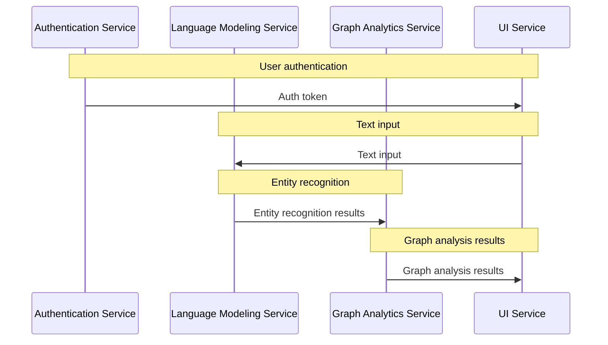

# Integration Guidelines
## Overview
This document provides guidelines for integrating the microservices, including best practices for API design, data flow, and error handling.

## Architecture
The system consists of multiple microservices, including:
* Authentication service
* Language modeling service
* Graph analytics service
* UI service

Each service is designed to perform specific functions and interacts with other services to provide a comprehensive solution.

## API Design
The APIs are designed using RESTful principles and follow standard HTTP methods for CRUD operations.

## Data Flow
The data flow between services is as follows:

## Error Handling
Each service handles errors using standard HTTP error codes and provides detailed error messages for debugging purposes.

## Setup Instructions
To set up the system, follow these steps:
1. Install the required dependencies for each service.
2. Configure the services according to the environment variables.
3. Start each service in the correct order (e.g., authentication service first).

## Example Use Cases
The following are example use cases for the system:
* User authentication and authorization
* Text analysis and entity recognition
* Graph analysis and visualization

## Conclusion
This documentation provides an overview of the integration guidelines for the microservices, including architecture, API design, data flow, and error handling. By following these guidelines, developers can ensure a smooth and efficient integration of the services.