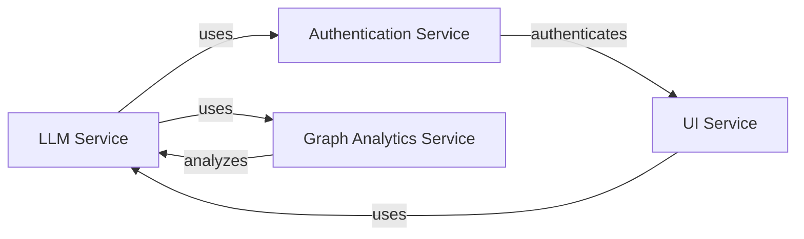
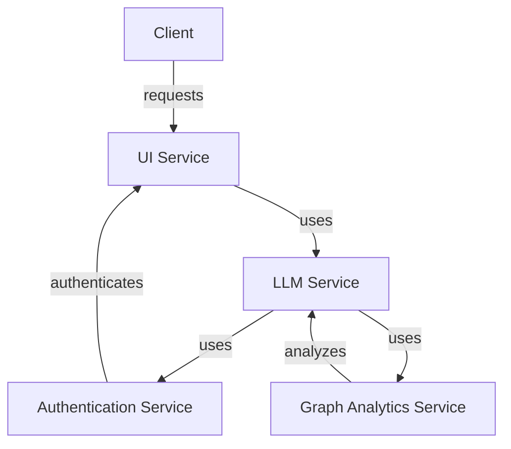

# Language Modeling Service Documentation
## Table of Contents
1. [Introduction](#introduction)
2. [Architecture](#architecture)
3. [Components](#components)
4. [Setup Instructions](#setup-instructions)
5. [Code Examples](#code-examples)
6. [Mermaid Diagrams](#mermaid-diagrams)

## Introduction
The Language Modeling Service is a microservice-based system that provides language modeling capabilities. It consists of several components, including the LLM Service, Authentication Service, Graph Analytics Service, and UI Service.

## Architecture
The architecture of the Language Modeling Service can be represented using the following mermaid diagram:

This diagram shows the relationships between the different components of the Language Modeling Service.

## Components
### LLM Service
The LLM Service is the core component of the Language Modeling Service. It provides language modeling capabilities and is responsible for processing and generating text.

### Authentication Service
The Authentication Service is responsible for authenticating users and providing access to the Language Modeling Service.

### Graph Analytics Service
The Graph Analytics Service is responsible for analyzing the graph structure of the language models and providing insights into the relationships between different concepts.

### UI Service
The UI Service is responsible for providing a user interface to the Language Modeling Service. It allows users to interact with the service and provides a way to visualize the results.

## Setup Instructions
To set up the Language Modeling Service, follow these steps:

1. Install the LLM Service by running `npm install` in the `workdir/services/llm-service` directory.
2. Install the Authentication Service by running `npm install` in the `workdir/services/auth-service` directory.
3. Install the Graph Analytics Service by running `npm install` in the `workdir/services/graph-analytics-service` directory.
4. Install the UI Service by running `npm install` in the `workdir/services/ui-service` directory.
5. Start the services by running `npm start` in each of the service directories.

## Code Examples
The following code example shows how to use the LLM Service to generate text:
```javascript
import { LLMService } from './llm-service';

const llmService = new LLMService();
const text = llmService.generateText('hello world');
console.log(text);
```
This code example shows how to use the Authentication Service to authenticate a user:
```javascript
import { AuthenticationService } from './auth-service';

const authenticationService = new AuthenticationService();
const user = authenticationService.authenticate('username', 'password');
console.log(user);
```
This code example shows how to use the Graph Analytics Service to analyze the graph structure of a language model:
```javascript
import { GraphAnalyticsService } from './graph-analytics-service';

const graphAnalyticsService = new GraphAnalyticsService();
const graph = graphAnalyticsService.analyzeGraph('language-model');
console.log(graph);
```
This code example shows how to use the UI Service to visualize the results of the Language Modeling Service:
```javascript
import { UIService } from './ui-service';

const uiService = new UIService();
const visualization = uiService.visualizeResults('results');
console.log(visualization);
```
## Mermaid Diagrams
The following mermaid diagram shows the high-level architecture of the Language Modeling Service:

This diagram shows the relationships between the different components of the Language Modeling Service and how they interact with each other.