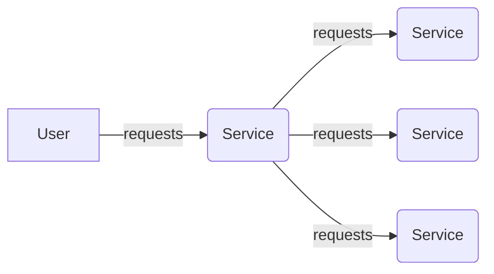

# UI Service Documentation
## Overview
The UI Service is a React-based application that provides a user interface for the overall system. It is designed to interact with the other microservices, including authentication, language modeling, and graph analytics.

## Features and Functionality
The UI Service includes the following features and functionality:

* User authentication and authorization
* Graph visualization and interaction
* Collaboration and real-time updates
* Settings and configuration options

### Code Examples
The UI Service is built using React and TypeScript. Here is an example of the App.tsx file:
```typescript
import React from 'react';
import { Store } from './store';

const App = () => {
  const { uiState } = Store.useStore();

  return (
    <div>
      <Toolbar />
      <GraphCanvas />
      <Sidebar />
    </div>
  );
};

export default App;
```
### Components
The UI Service includes several key components, including:

* NotificationStack: a component that displays notifications to the user
* Toolbar: a component that provides navigation and menu options
* GraphCanvas: a component that displays the graph visualization
* Sidebar: a component that provides additional information and settings

### Setup Instructions
To set up the UI Service, follow these steps:

1. Install the required dependencies: `npm install`
2. Start the development server: `npm run start`
3. Open the application in your web browser: `http://localhost:3000`

### mermaid Diagrams
Here is an example of a mermaid diagram that shows the high-level architecture of the UI Service:

This diagram shows the interaction between the UI Service and the other microservices.