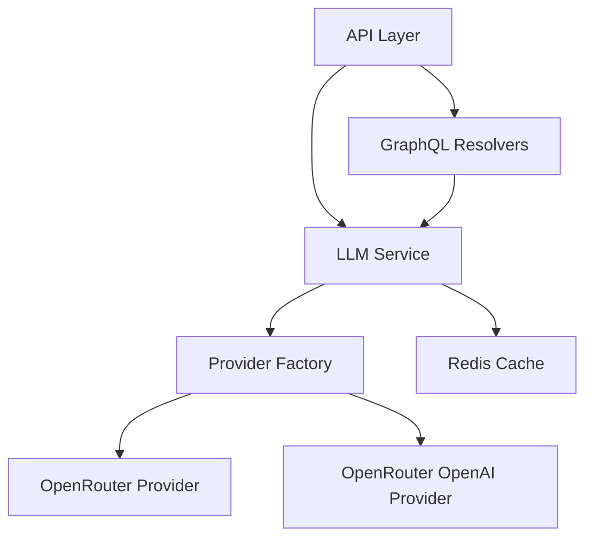
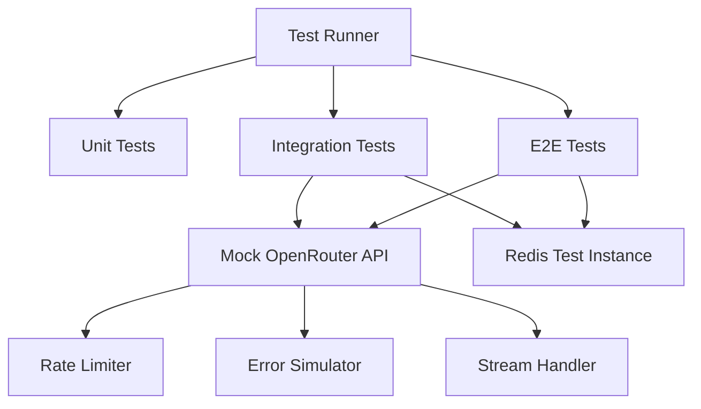
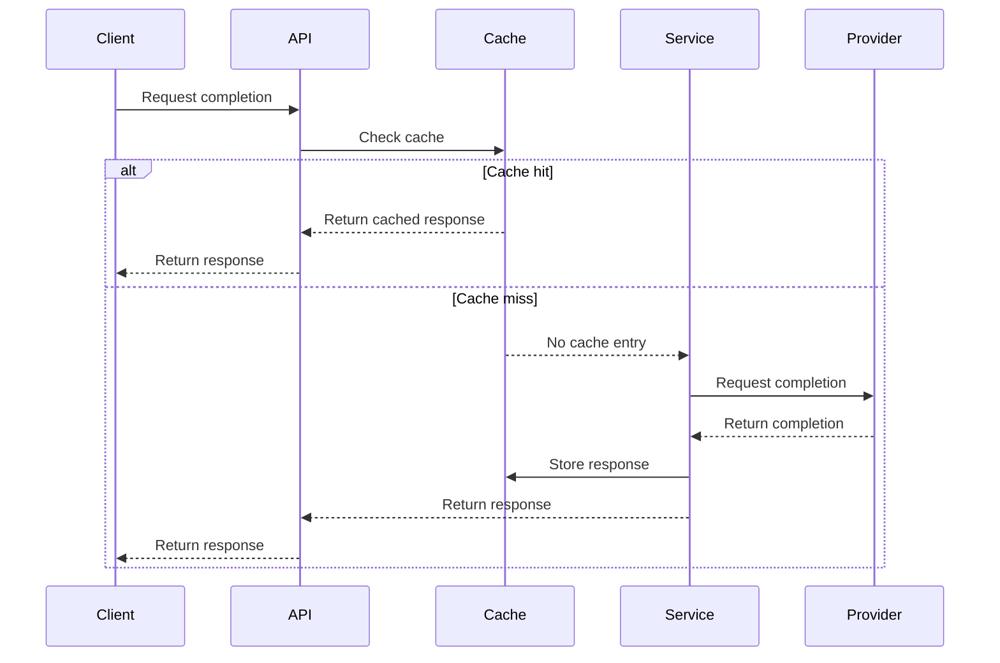
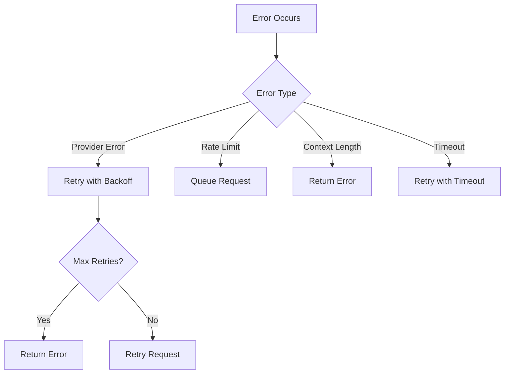
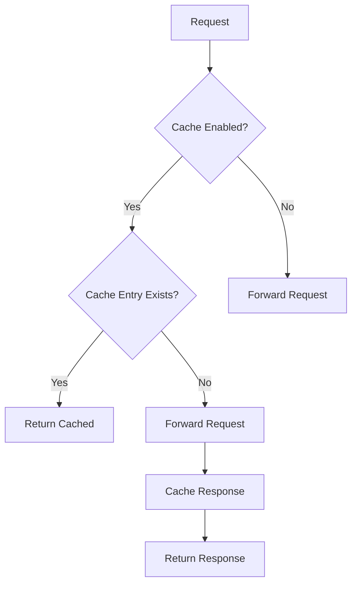
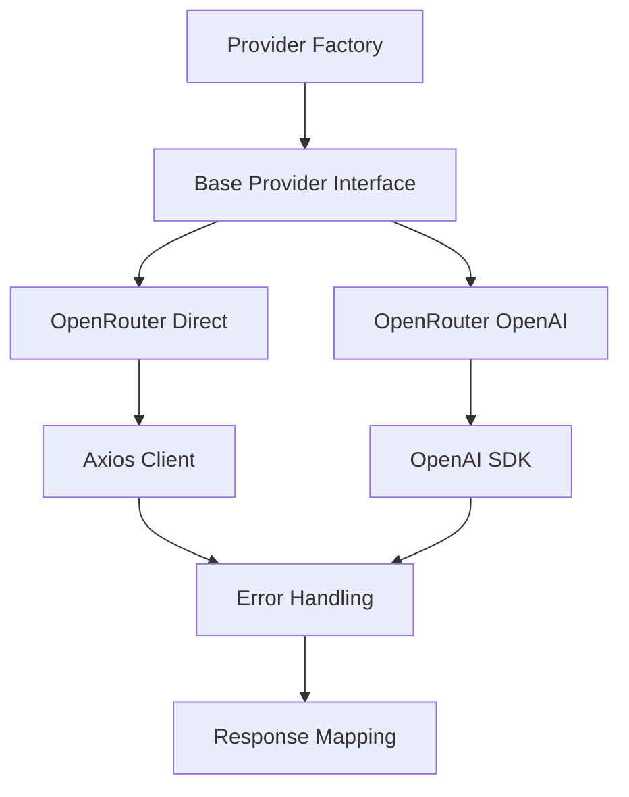
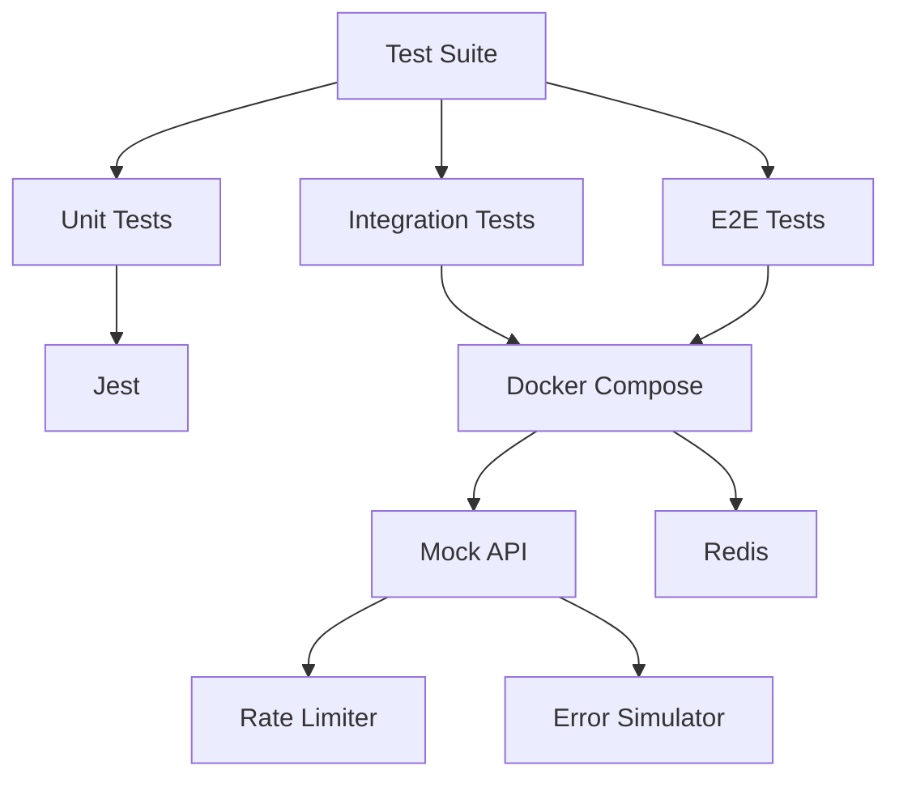
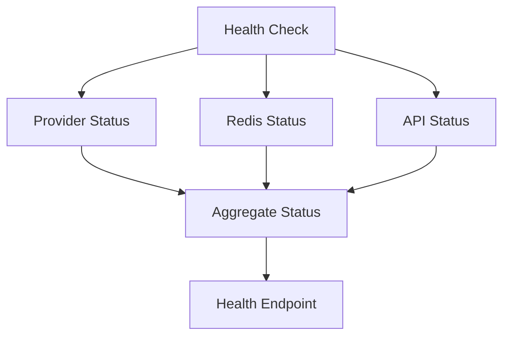

# LLM Service Architecture

## Overview

The LLM Service is designed with a modular architecture that separates concerns and enables easy extension with new providers. The service integrates with OpenRouter as the primary LLM provider, with support for both direct API calls and OpenAI SDK integration.

## Core Components

### API Layer
- REST endpoints for completions and health checks
- GraphQL resolvers for queries and subscriptions
- Request validation and error handling
- Response formatting

### LLM Service
- Core business logic
- Provider selection and management
- Caching strategy
- Error handling and retries
- Request/response transformation

### Provider Factory
- Provider instantiation and configuration
- Provider health checks
- Model mapping and validation
- Fallback handling

### Redis Cache
- Response caching
- Cache invalidation
- TTL management
- Health monitoring

## Test Infrastructure

### Mock OpenRouter API
- Simulates OpenRouter API responses
- Implements rate limiting
- Handles streaming responses
- Simulates various error conditions
- Configurable latency and timeouts

### Test Containers
- Redis test instance
- Mock OpenRouter API service
- Isolated test network
- Health checks and readiness probes

### Test Coverage
- Unit tests: Provider implementations, service logic
- Integration tests: Redis caching, provider integration
- E2E tests: API endpoints, GraphQL resolvers

## Data Flow

## Error Handling

### Error Types
- Provider errors: Authentication, availability
- Rate limiting: Per-provider and global limits
- Context length: Model-specific limits
- Timeouts: Network and provider timeouts
- Validation: Request parameter validation

## Caching Strategy

### Cache Implementation
- Redis as primary cache store
- Configurable TTL per response
- Cache key generation based on request parameters
- Cache invalidation on error
- Cache bypass for streaming requests

## Provider Implementation

### Provider Interface
- Standard methods for all providers
- Error handling and retries
- Response transformation
- Health checks
- Configuration validation

## Testing Architecture

### Test Components
- Mock OpenRouter API for integration testing
- Redis instance for cache testing
- Docker Compose for test environment
- Jest for test execution
- Supertest for HTTP testing

## Monitoring and Health Checks

### Health Monitoring
- Provider availability checks
- Redis connection status
- API endpoint health
- Response time monitoring
- Error rate tracking