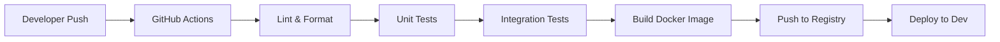

# CI/CD Pipeline Documentation

## Overview
This document outlines the Continuous Integration and Continuous Deployment (CI/CD) pipeline for the microservices architecture, focusing on the authentication service.

## Pipeline Structure

### Development Workflow


## GitHub Actions Configuration

### Main Workflow
```yaml
name: Auth Service CI/CD

on:
  push:
    branches: [ main ]
    paths:
      - 'services/auth-service/**'
  pull_request:
    branches: [ main ]
    paths:
      - 'services/auth-service/**'

jobs:
  test:
    runs-on: ubuntu-latest
    defaults:
      run:
        working-directory: services/auth-service

    steps:
      - uses: actions/checkout@v2
      
      - name: Setup Node.js
        uses: actions/setup-node@v2
        with:
          node-version: '16'
          
      - name: Install Dependencies
        run: npm ci
        
      - name: Lint
        run: npm run lint
        
      - name: Run Tests
        run: npm test
        
      - name: Build
        run: npm run build

  docker:
    needs: test
    runs-on: ubuntu-latest
    if: github.ref == 'refs/heads/main'
    
    steps:
      - uses: actions/checkout@v2
      
      - name: Set up Docker Buildx
        uses: docker/setup-buildx-action@v1
        
      - name: Login to Container Registry
        uses: docker/login-action@v1
        with:
          registry: ghcr.io
          username: ${{ github.actor }}
          password: ${{ secrets.GITHUB_TOKEN }}
          
      - name: Build and Push
        uses: docker/build-push-action@v2
        with:
          context: services/auth-service
          push: true
          tags: ghcr.io/${{ github.repository }}/auth-service:latest
```

## Testing Strategy

### Unit Tests
- Run for every push and pull request
- Must pass before merge
- Coverage thresholds:
  ```javascript
  // jest.config.js
  coverageThreshold: {
    global: {
      branches: 80,
      functions: 80,
      lines: 80,
      statements: 80
    }
  }
  ```

### Integration Tests
- Run in isolated Docker environment
- Test database interactions
- API endpoint validation
- Health check verification

## Deployment Stages

### Development
- Automatic deployment on main branch
- Environment: Development cluster
- URL: dev.api.example.com

### Staging
- Manual trigger after development
- Environment: Staging cluster
- URL: staging.api.example.com

### Production
- Manual approval required
- Environment: Production cluster
- URL: api.example.com

## Environment Configuration

### Development
```yaml
environment:
  DB_HOST: postgres
  DB_PORT: 5432
  DB_USER: ${POSTGRES_USER}
  DB_PASSWORD: ${POSTGRES_PASSWORD}
  DB_NAME: auth
  NEO4J_URI: bolt://neo4j:7687
  NEO4J_USER: ${NEO4J_USER}
  NEO4J_PASSWORD: ${NEO4J_PASSWORD}
  NODE_ENV: development
```

### Production
```yaml
environment:
  DB_HOST: ${PROD_DB_HOST}
  DB_PORT: ${PROD_DB_PORT}
  DB_USER: ${PROD_DB_USER}
  DB_PASSWORD: ${PROD_DB_PASSWORD}
  DB_NAME: ${PROD_DB_NAME}
  NEO4J_URI: ${PROD_NEO4J_URI}
  NEO4J_USER: ${PROD_NEO4J_USER}
  NEO4J_PASSWORD: ${PROD_NEO4J_PASSWORD}
  NODE_ENV: production
```

## Monitoring & Alerts

### Health Checks
- Endpoint: `/health`
- Frequency: Every 30 seconds
- Alert on:
  - Response time > 1s
  - Status != 200
  - Database disconnection

### Metrics
- Request rate
- Error rate
- Response time
- Database connection pool
- Container resource usage

## Security Measures

### Secrets Management
- GitHub Secrets for credentials
- Environment-specific values
- Rotation policy: 90 days

### Container Security
- Regular base image updates
- Security scanning in pipeline
- No root user in containers

## Rollback Procedure

### Automatic Rollback
1. Monitor deployment health
2. Detect critical errors
3. Revert to last stable version
4. Alert development team

### Manual Rollback
```bash
# Revert to previous version
kubectl rollout undo deployment/auth-service

# Verify rollback
kubectl rollout status deployment/auth-service
```

## Related Documentation
- [Docker Setup](../tools/docker.md)
- [Phase 1 Timeline](../implementation/phase1-timeline.md)